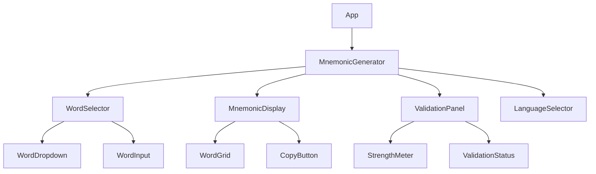
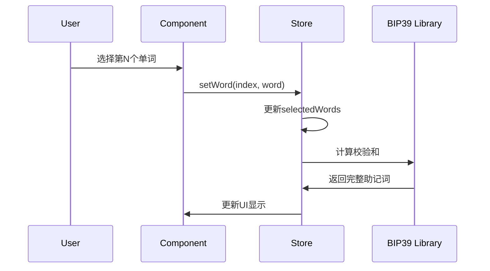
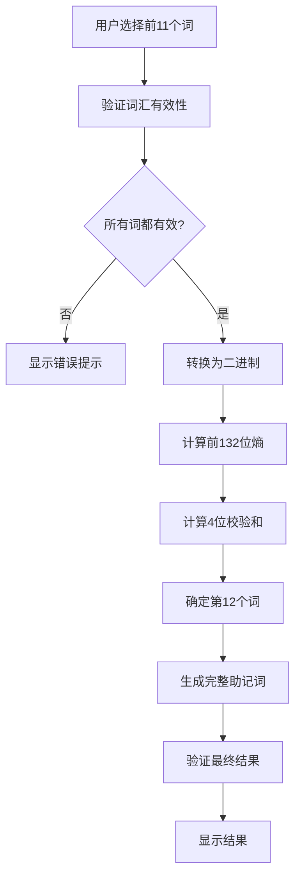
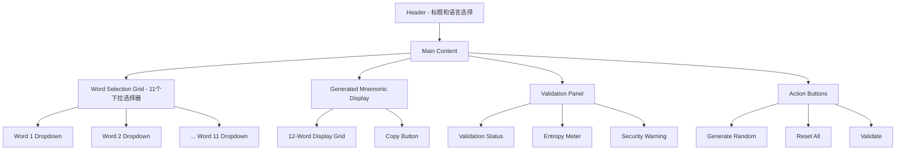

# BIP39助记词生成器设计文档

## 概述

BIP39助记词生成器是一个允许用户自定义前11个单词的助记词生成工具。该工具能够根据用户选择的前11个单词，自动计算并生成符合BIP39标准的完整12词助记词，确保生成的助记词具有正确的校验和。

### 核心功能
- 支持用户选择前11个助记词
- 自动计算第12个校验词
- 验证助记词的有效性
- 支持多种语言的BIP39词典
- 提供助记词强度评估

## 技术栈与依赖

### 前端技术栈
- **框架**: React 18 with TypeScript
- **UI库**: Ant Design 5.x
- **状态管理**: Zustand
- **路由**: React Router v6
- **样式**: Tailwind CSS + Ant Design
- **构建工具**: Vite
- **包管理**: npm

### 核心依赖
- `bip39`: BIP39助记词处理库
- `crypto-js`: 加密算法支持
- `buffer`: Buffer polyfill for browser

## 组件架构

### 组件层次结构



### 核心组件定义

#### MnemonicGenerator 主组件
```typescript
interface MnemonicGeneratorProps {
  defaultLanguage?: string;
  onMnemonicGenerated?: (mnemonic: string) => void;
}

interface MnemonicGeneratorState {
  selectedWords: string[];
  generatedMnemonic: string;
  isValid: boolean;
  language: string;
  wordList: string[];
}
```

#### WordSelector 词汇选择器
```typescript
interface WordSelectorProps {
  wordList: string[];
  selectedWords: string[];
  onWordChange: (index: number, word: string) => void;
  onRandomWord: (index: number) => void;
}
```

#### MnemonicDisplay 助记词显示
```typescript
interface MnemonicDisplayProps {
  mnemonic: string;
  highlightChecksum?: boolean;
  onCopy?: () => void;
}
```

#### ValidationPanel 验证面板
```typescript
interface ValidationPanelProps {
  mnemonic: string;
  isValid: boolean;
  entropy: number;
  onValidate: () => void;
}
```

## 路由与导航

### 路由结构
```
/                    - 主生成器页面
/about              - 关于BIP39说明
/batch              - 批量生成模式
/import             - 导入现有助记词验证
```

### 导航组件
- 顶部导航栏包含页面切换
- 侧边栏包含快速操作按钮
- 面包屑导航显示当前位置

## 样式策略

### 设计原则
- **简洁性**: 使用Ant Design的简洁风格
- **响应式**: 支持桌面和移动端
- **可访问性**: 符合WCAG 2.1 AA标准
- **主题**: 支持明暗主题切换

### CSS架构
- 使用Tailwind CSS进行基础样式
- Ant Design组件覆盖特定样式
- CSS Variables实现主题切换
- 模块化CSS for组件特定样式

## 状态管理

### Zustand Store结构

```typescript
interface MnemonicStore {
  // 状态
  selectedWords: string[];
  generatedMnemonic: string;
  language: string;
  wordList: string[];
  isValid: boolean;
  entropy: number;
  
  // 操作
  setWord: (index: number, word: string) => void;
  generateMnemonic: () => void;
  validateMnemonic: (mnemonic: string) => boolean;
  setLanguage: (language: string) => void;
  resetGenerator: () => void;
  randomizeWord: (index: number) => void;
}
```

### 状态更新流程



## API集成层

### BIP39核心算法

#### 助记词生成流程
```typescript
class MnemonicGenerator {
  private wordList: string[];
  
  constructor(language: string = 'english') {
    this.wordList = bip39.wordlists[language];
  }
  
  generateFromPrefix(selectedWords: string[]): string {
    // 1. 验证前11个词是否在词典中
    // 2. 计算前11个词的二进制表示
    // 3. 计算校验和
    // 4. 确定第12个词
    // 5. 返回完整助记词
  }
  
  validateMnemonic(mnemonic: string): boolean {
    return bip39.validateMnemonic(mnemonic);
  }
  
  calculateEntropy(mnemonic: string): number {
    // 计算助记词的熵值
  }
}
```

#### 校验算法实现
```typescript
interface ChecksumCalculator {
  calculateChecksum(words: string[]): string;
  findValidWord(prefix: string[], wordList: string[]): string;
  validateWordSequence(words: string[]): boolean;
}
```

## 核心业务逻辑

### 助记词生成算法



### 数据验证层
```typescript
interface ValidationRules {
  validateWordInDictionary: (word: string, wordList: string[]) => boolean;
  validateMnemonicLength: (words: string[]) => boolean;
  validateChecksumIntegrity: (mnemonic: string) => boolean;
  calculateStrengthScore: (mnemonic: string) => number;
}
```

### 安全性考虑
- 客户端随机数生成使用`crypto.getRandomValues()`
- 不在本地存储私钥或敏感信息
- 提供熵值强度检查
- 警告用户关于自定义助记词的安全风险

## 用户界面设计

### 主界面布局



### 交互流程
1. 用户选择语言（默认英语）
2. 用户通过下拉菜单选择前11个词
3. 系统实时计算第12个词
4. 显示完整的12词助记词
5. 提供验证和复制功能

## 测试策略

### 单元测试
```typescript
describe('MnemonicGenerator', () => {
  test('应该为有效的前11个词生成正确的第12个词', () => {
    // 测试校验和计算
  });
  
  test('应该拒绝无效的词汇', () => {
    // 测试词典验证
  });
  
  test('应该正确计算熵值', () => {
    // 测试熵值计算
  });
});

describe('BIP39算法', () => {
  test('生成的助记词应该通过bip39.validateMnemonic验证', () => {
    // 测试与标准库的兼容性
  });
});
```

### 集成测试
- 测试完整的用户操作流程
- 验证不同语言词典的兼容性
- 测试边界条件和错误处理

### 端到端测试
```typescript
describe('BIP39生成器E2E测试', () => {
  test('用户可以选择11个词并生成有效助记词', () => {
    // 使用Cypress测试完整流程
  });
  
  test('复制功能正常工作', () => {
    // 测试剪贴板操作
  });
});
```

## 部署配置

### 构建配置
```javascript
// vite.config.ts
export default defineConfig({
  build: {
    rollupOptions: {
      external: ['crypto'], // Node.js crypto模块
    }
  },
  define: {
    global: 'globalThis', // Buffer polyfill
  }
});
```

### 环境变量
```
VITE_DEFAULT_LANGUAGE=english
VITE_ENABLE_ANALYTICS=false
VITE_SECURITY_WARNINGS=true
```